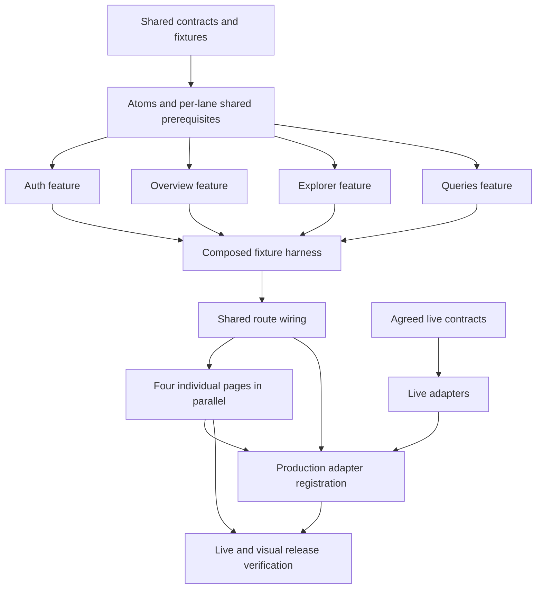

# Web client implementation handoff

This plan covers the four inspected prototype views: **Sign in, Overview,
Dataset Explorer and SQL Workspace**. The user requested atomic components
first, parallel feature work and individual pages last, then confirmed:
“Fixture demos first; live integration required before release.”

| Read | Purpose |
| --- | --- |
| [Specification](spec.md) | 21 functional requirements, 10 technical constraints and 21 acceptance criteria |
| [Design inventory](design-inventory.md) | Observed views, component mapping, tokens, responsive evidence and required prototype corrections |
| [Implementation plan](plan.md) | Boundaries, current remaining integration sequence, seven delivery phases and verification strategy |
| [Auth HTTP contract](contracts/auth.md) | October 5 backend handoff: endpoints, session/CSRF, local proxy, frontend mapping gaps and pending live checks |
| [Data API v1](contracts/data-api.md) | Service contracts, OpenAPI/fixture snapshots and source provenance |
| [Contract comparison](contracts/contract-review.md) | Frontend differences, new behavior and backend artifact issues |
| [Live readiness](contracts/live-readiness.md) | Per-operation contract inputs and remaining integration gates |
| [Task manifest](tasks.md) | Executable tasks, predecessors, owners, parallel lanes and phase checkpoints |
| [Technical execution plan](execution-plan.md) | Exact phase triggers, three-worker schedule, architecture rules, agent handoffs and Figma acceptance |
| [Execution state](execution-state.md) | Coordinator-owned assignments, evidence and external gates; Phases 1–4 and Phase 5 fixture branch implemented |
| [Council decisions](council/03-decisions.md) | Contested choices, original arguments and concessions |
| [Risks and test scenarios](council/05-risks-and-tests.md) | Cross-session races, cursor/execution lifecycles, precision and production fixture exclusion |

## Parallel delivery

The task manifest contains **78 tasks across seven phases**, with **24 marked
parallelizable** and explicit file ownership, dependencies and acceptance checks.

1. Establish the toolchain, public session/catalog contracts and fixture seams.
2. Build design tokens and atomic components, then required molecules,
   shared organisms and templates.
3. Start **Auth**, **Overview**, **Explorer** and **Queries** work independently
   as their named component prerequisites pass. Shared contracts and root
   configuration have one owner; feature teams own disjoint modules.
4. Pass all four feature checkpoints and the composed fixture harness.
5. Complete shared route/layout wiring, then assemble the four pages in parallel.
6. Complete live integration and release checks separately from fixture demos.

Use the task manifest's exact predecessor IDs when assigning work. Phase numbers
alone do not define whether a task can start. Unavailable live contracts block
their own adapters and release acceptance; they do not block fixture page demos.

This diagram summarizes the gates; lane-specific dependencies in the task
manifest determine actual scheduling.

## Design evidence and corrections

The [Figma Make project](https://www.figma.com/make/9k3dy9IWG5UavJ0VgaZJ1G/Outage-Explorer-Prototype)
returned unreadable source resource links. The user then supplied the
[published prototype](https://apply-less-42002887.figma.site/), which was inspected
through its public HTML/styles/application bundle and rendered desktop/narrow
views. Ten reference captures are linked from the design inventory.

Keep its visual structure while correcting demo-only behavior: Cognito managed
login replaces the local password form; role selection stays outside production;
preview cursors replace fixed counts; SQL pages retain one execution; exact
percentages replace inconsistent rounding. Required states absent from the
prototype are documented extensions. The Overview national trend is included;
Admin refresh controls and the deferred new-data card remain excluded.

## Remaining inputs

- Auth handoff is documented with source revision/digest; target environment,
  responsible integration person and frontend mapping remain pending. Data API v1
  service contracts are now received; backend runtime and contract reconciliation
  remain pending.
- SQL contract defaults/TTL/delivery are supplied; source fixture corrections,
  typed result/recovery mapping and live validation remain.
- Final browser/viewport acceptance and usable asset/font provenance.

Foundation, tokens/atoms and shared molecules/organisms/templates are implemented; see the
[foundation verification](verification/phase-1.md),
[atomic verification](verification/phase-2.md),
[shared-component verification](verification/phase-3.md)
and [execution ledger](execution-state.md). The Auth, Overview, Explorer and Queries fixture features are implemented and
accepted; see [Phase 4 verification](verification/phase-4.md). The Phase 5 composed
fixture harness is accepted; see [Phase 5 verification](verification/phase-5.md).
The four fixture page compositions are accepted; see [Phase 6 verification](verification/phase-6.md). Live adapters and T6.L registration remain blocked on Q2/Q3; production routes show explicit unavailability until live registration.

These are named gates in the plan and tasks. The documented auth source contract
does not establish production deployment or completed live/visual acceptance.

The council converged after one critique/author-response round and one focused
closure round. Its full record is [anchor](council/00-problem.md),
[interrogation](council/01-interrogation.md), [proposals](council/02-proposals.md),
[decisions](council/03-decisions.md), [debate](council/04-debate.md) and
[risks](council/05-risks-and-tests.md).

## Frontend contract adaptation — October 5, 2026

The user accepted date-only filters and independently optional start/end bounds;
valid ranges outside coverage show empty results. The backend will add auth
capability fields, so auth mapping awaits the expanded DTO. Local data decoders,
injected operations, complete national preview assembly, exact fractions, richer
tables and explicit SQL recovery are prepared; production remains unavailable.
See the [expected-versus-available proposal and implementation record](contracts/frontend-adaptation.md).
Controlled tests do not establish live readiness; no backend responses are
expected yet. Earlier fixture milestones remain historical evidence.

The main plan and task manifest now reflect the latest backend-controlled auth
boundary and supplied SQL settings. Follow the [remaining integration sequence](plan.md#remaining-implementation-sequence--reconciled-october-5)
and current Phase 5 paths; prepared data modules are reused, and live checkboxes
remain open. Earlier run outcomes remain historical evidence.
