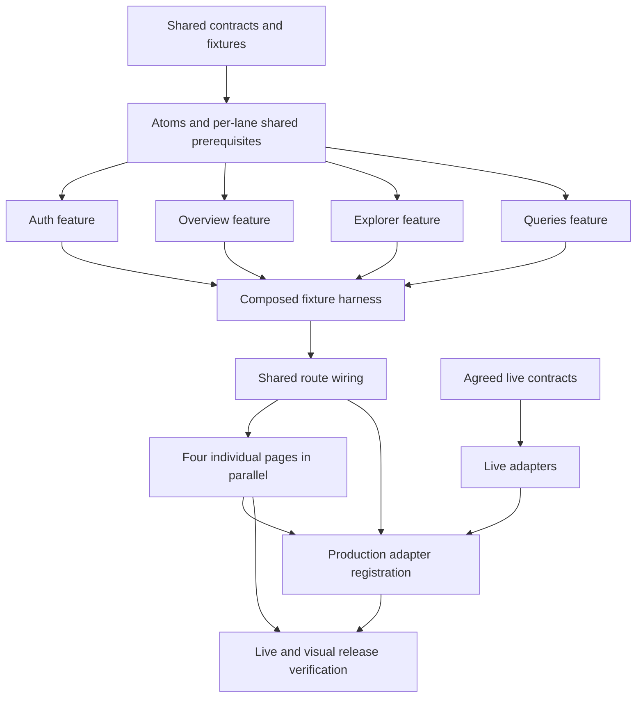

# Web client implementation handoff

October 7 facility-preview update: Facilities now offers Analyst/Admin an
optional exact facility-ID input combined with dates. Catalog decoding and the
adapter also support Generators' facility capability; Viewer restrictions remain.
See the [contract and verification](verification/facility-filter.md). Runtime acceptance requires a
matching protocol-v2 worker image and remains open.

For source-checked implementation and open gates, see
[current status](../../development/current-status.md). Dated intake below is
provenance; it does not require rebuilding adapters already registered.

October 7 follow-up: production now reuses one authorized catalog across route
navigation under the agreed 256 KiB admission cap; Overview dates are applied
explicitly. See [correction evidence](../../../specs/data-reuse/verification/navigation-and-dates.md).
This does not close live, visual or release gates.

This plan covers the four inspected prototype views: **Sign in, Overview,
Dataset Explorer and SQL Workspace**. The user requested atomic components
first, parallel feature work and individual pages last, then confirmed:
“Fixture demos first; live integration required before release.”

| Read | Purpose |
| --- | --- |
| [Specification](spec.md) | 21 functional requirements, 10 technical constraints and 21 acceptance criteria |
| [Design inventory](design-inventory.md) | Observed views, component mapping, tokens, responsive evidence and required prototype corrections |
| [Implementation plan](plan.md) | Boundaries, current remaining integration sequence, seven delivery phases and verification strategy |
| [Auth HTTP contract](contracts/auth.md) | October 5 backend handoff: endpoints, session/CSRF, local proxy, frontend mapping gaps and pending live checks |
| [Data API v1](contracts/data-api.md) | Service contracts, OpenAPI/fixture snapshots and source provenance |
| [Contract comparison](contracts/contract-review.md) | Frontend differences, new behavior and backend artifact issues |
| [Live readiness](contracts/live-readiness.md) | Per-operation contract inputs and remaining integration gates |
| [Task manifest](tasks.md) | Executable tasks, predecessors, owners, parallel lanes and phase checkpoints |
| [Technical execution plan](execution-plan.md) | Exact phase triggers, three-worker schedule, architecture rules, agent handoffs and Figma acceptance |
| [Execution state](execution-state.md) | Coordinator-owned assignments, evidence and external gates; Phases 1–4 and Phase 5 fixture branch implemented |
| [Council decisions](council/03-decisions.md) | Contested choices, original arguments and concessions |
| [Risks and test scenarios](council/05-risks-and-tests.md) | Cross-session races, cursor/execution lifecycles, precision and production fixture exclusion |

## Current integration intake — October 5, 2026

The user confirms the documented backend services are implemented and ready for
frontend integration. The updated source handoff confirms all seven operations
are implemented and opt-in, closes the former B1–B3 artifact issues and permits
null query generation identity for reference-free SQL. See the [integration completion spec](../../../specs/backend-integration/spec.md)
and [state/security assessment](integration-assessment.md) for current source hashes, remaining frontend behavior,
state-management options and SQL-security recommendations.

This update supersedes backend-pending statements below, which retain historical
intake provenance. Production auth/data adapters are structurally registered;
connected acceptance remains open. Backend analytical resources must be
explicitly configured for the named live target; user-owned isolation validation
is outside this frontend work. No live or visual acceptance gate is closed here.

## Integration completion planning

The active [integration completion plan](../../../specs/backend-integration/plan.md)
turns the [integration spec](../../../specs/backend-integration/spec.md) into the
remaining design strategy. It reuses the established component and adapter work;
its scope supplements the original delivery plan and preserves existing live and
page-assembly gates. The [state/security assessment](integration-assessment.md)
records the supporting findings. The user authorized implementation on October 5. Follow the
[integration task list](../../../specs/backend-integration/tasks.md), one phase
per implementation run; [phase-1 evidence](../../../specs/backend-integration/verification/phase-1.md)
records current contract reconciliation. Controlled phase completion does not
close connected adapter, production registration, visual or release gates.

The backend-integration protected lifecycle phase is complete under controlled
checks: same-generation denial revocation, original SQL expiry and UTF-8 submission
bounds. See [phase 2 evidence](../../../specs/backend-integration/verification/phase-2.md).
Connected operation registration and live acceptance remain open.

Backend-integration phase 3 prepared authenticated data composition separately
from production registration, hardened transport publication guards and
revalidated catalog/preview, complete national range and retained SQL seams.
See [controlled adapter evidence](verification/integration-adapters.md).
Production data registration is phase 4; connected acceptance is phase 5.

Backend-integration phase 4 registers live data factories and independent
preview/query settings in the existing pages. See [phase-4 evidence](../../../specs/backend-integration/verification/phase-4.md)
for controlled page/browser checks and fresh build/fixture-boundary results.
Original T5.L/T6.L connected acceptance and visual/release sign-off remain open.

## Parallel delivery

The task manifest contains **78 tasks across seven phases**, with **21 marked
parallelizable** and explicit file ownership, dependencies and acceptance checks.

1. Establish the toolchain, public session/catalog contracts and fixture seams.
2. Build design tokens and atomic components, then required molecules,
   shared organisms and templates.
3. Start **Auth**, **Overview**, **Explorer** and **Queries** work independently
   as their named component prerequisites pass. Shared contracts and root
   configuration have one owner; feature teams own disjoint modules.
4. Pass all four feature checkpoints and the composed fixture harness.
5. Complete shared route/layout wiring, then assemble the four pages in parallel.
6. Complete live integration and release checks separately from fixture demos.

Use the task manifest's exact predecessor IDs when assigning work. Phase numbers
alone do not define whether a task can start. Unavailable live contracts block
their own adapters and release acceptance; they do not block fixture page demos.

This diagram summarizes the gates; lane-specific dependencies in the task
manifest determine actual scheduling.

## Design evidence and corrections

The [Figma Make project](https://www.figma.com/make/9k3dy9IWG5UavJ0VgaZJ1G/Outage-Explorer-Prototype)
returned unreadable source resource links. The user then supplied the
[published prototype](https://apply-less-42002887.figma.site/), which was inspected
through its public HTML/styles/application bundle and rendered desktop/narrow
views. Ten reference captures are linked from the design inventory.

Keep its visual structure while correcting demo-only behavior: Cognito managed
login replaces the local password form; role selection stays outside production;
preview cursors replace fixed counts; SQL pages retain one execution; exact
percentages replace inconsistent rounding. Required states absent from the
prototype are documented extensions. The Overview national trend is included;
Admin refresh controls on Overview are approved and implemented. A separate
Admin page and the deferred new-data card remain outside current scope.

## Historical remaining inputs — before data registration

This section records the earlier auth-only checkpoint. Data adapters have since
been registered; current remaining work is named-target live acceptance and
visual/release evidence, as listed in the current-status reference above.

**Auth integration is implemented; connected data and full live acceptance are next.** The user confirmed backend auth is
ready on October 5. Read the [remaining implementation sequence](plan.md#remaining-implementation-sequence--reconciled-october-5),
then [Phase 5: T5.3 Auth → T5.4 → T5.5](tasks/phase-5.md#current-implementation-connected-backend-auth)
and the [auth contract](contracts/auth.md). The current user-approved role mapping and local proxy are implemented; see
[auth integration evidence](verification/auth-integration.md). Data readiness is separate.

- Auth handoff is documented with source revision/digest; local target and role presentation mapping are recorded;
  full authenticated browser lifecycle acceptance remains pending. Data API v1
  service contracts are now received; backend runtime and contract reconciliation
  remain pending.
- SQL contract defaults/TTL/delivery are supplied; source fixture corrections,
  typed result/recovery mapping and live validation remain.
- Final browser/viewport acceptance and usable asset/font provenance.

Foundation, tokens/atoms and shared molecules/organisms/templates are implemented; see the
[foundation verification](verification/phase-1.md),
[atomic verification](verification/phase-2.md),
[shared-component verification](verification/phase-3.md)
and [execution ledger](execution-state.md). The Auth, Overview, Explorer and Queries fixture features are implemented and
accepted; see [Phase 4 verification](verification/phase-4.md). The Phase 5 composed
fixture harness is accepted; see [Phase 5 verification](verification/phase-5.md).
The four fixture page compositions are accepted; see [Phase 6 verification](verification/phase-6.md). Auth-only production composition is implemented. Full T6.L registration still requires connected data adapters and their evidence; data operations remain explicitly unavailable.

These are named gates in the plan and tasks. The documented auth source contract
does not establish production deployment or completed live/visual acceptance.

The council converged after one critique/author-response round and one focused
closure round. Its full record is [anchor](council/00-problem.md),
[interrogation](council/01-interrogation.md), [proposals](council/02-proposals.md),
[decisions](council/03-decisions.md), [debate](council/04-debate.md) and
[risks](council/05-risks-and-tests.md).

## Historical frontend contract adaptation — October 5, 2026

This section records intake before production registration. Its next steps and
unavailable-production statements are historical, not current work instructions.

The user accepted date-only filters and independently optional start/end bounds;
valid ranges outside coverage show empty results. The user now confirms backend
auth works and is ready for frontend integration; confirm current capability
fields during intake and implement the auth adapter next. Local data decoders,
injected operations, complete national preview assembly, exact fractions, richer
tables and explicit SQL recovery are prepared; production remains unavailable.
See the [expected-versus-available proposal and implementation record](contracts/frontend-adaptation.md).
Controlled tests do not establish live acceptance. Backend auth is ready per the
user; the earlier expectation of no API responses now applies to data services.
Earlier fixture milestones remain historical evidence.

The main plan and task manifest now reflect the latest backend-controlled auth
boundary and supplied SQL settings. Follow the [remaining integration sequence](plan.md#remaining-implementation-sequence--reconciled-october-5)
and current Phase 5 paths; prepared data modules are reused, and live checkboxes
remain open. Earlier run outcomes remain historical evidence.

## Admin refresh scope update — October 5, 2026

The user now requests the refresh endpoint button on Overview for Admin users.
This enables that scoped control, superseding earlier statements that refresh
controls were deferred. The existing Overview composition uses shared button
and status atoms/molecules; no separate Admin page or deferred new-data card is
added. See the [refresh implementation contract](contracts/refresh.md) for admission/status,
idempotency and access-change behavior. Connected refresh acceptance remains
separate from controlled frontend tests.
