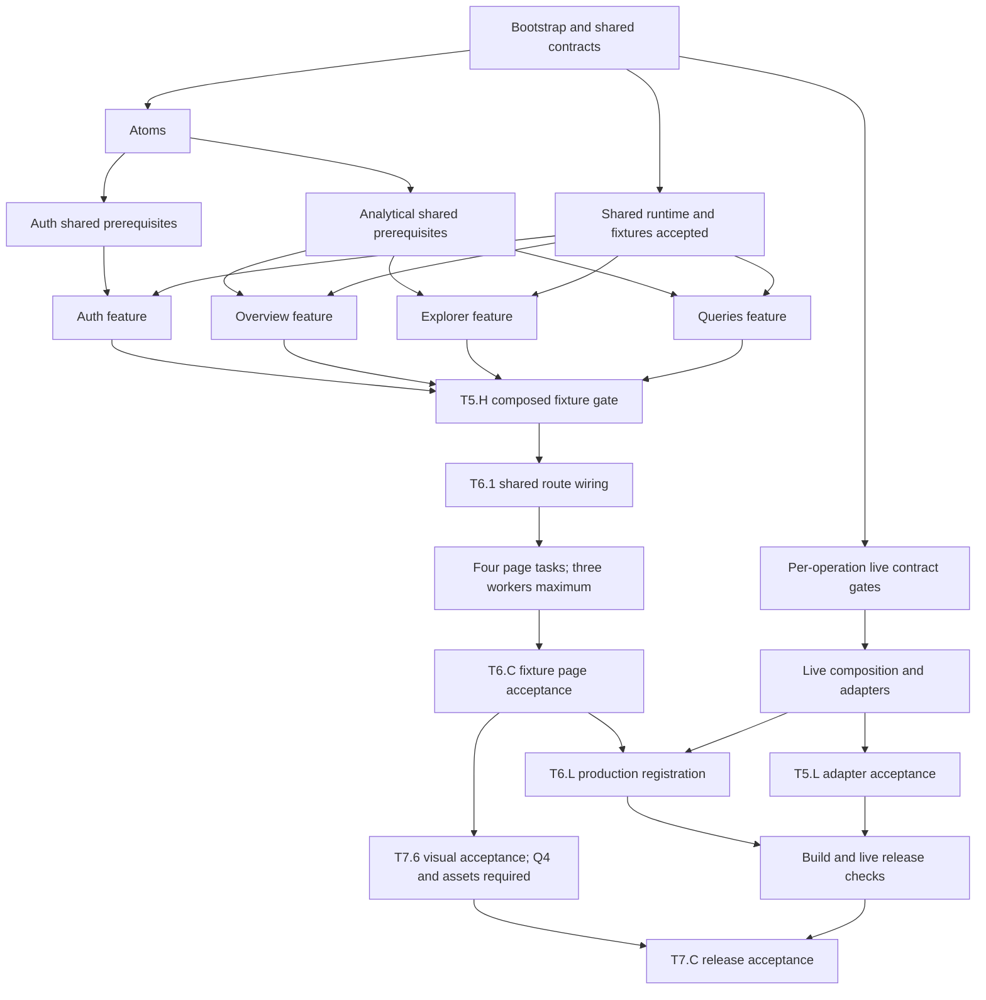

# Technical execution plan: parallel web-client delivery

> Implementation runbook for the existing 78 tasks. Phase 1 execution evidence
> is recorded in [execution state](execution-state.md); this runbook does not add
> product scope or replace task acceptance criteria.

## Current implementation reference — October 7, 2026

Configured frontend auth/data registration is implemented. Use
[current status](../../development/current-status.md) and
[backend-integration Phase 5](../../../specs/backend-integration/tasks.md) for
remaining connected acceptance. Original parallel delivery schedules below
retain historical task dependencies, not instructions to recreate completed modules.

## Historical integration amendment — October 5, 2026

Use the [remaining sequence](plan.md#remaining-implementation-sequence--reconciled-october-5)
and current [Phase 5 paths](tasks/phase-5.md) for outstanding work. Fixtures and
page assembly are accepted; local data modules are already implemented/tested.
The user confirms backend auth works and is ready for frontend integration.
Start T5.3 Auth intake of current capability fields/configuration, then T5.4/T5.5;
data API availability does not block this sequence. The client sends no role/capability claims and needs no role field.
Flask owns PKCE and callback; local development uses the same-origin `/api` proxy.

T5.6–T5.8 share implemented modules and must be serialized under Integration;
the original parallel data-lane schedule below is historical for those tasks.
Do not create the former separate catalog/preview/metric/query adapter filenames.
Controlled preparation is authorized without API responses; actual T5.L/T6.L
and release acceptance still require their stated evidence. SQL contract settings
are supplied, not an unresolved configuration-design question.

## Authority and operating model

Read the [specification](spec.md), [architecture plan](plan.md),
[task manifest](tasks.md) and [design inventory](design-inventory.md). The phase
files own exact files, predecessors and acceptance. This document defines how a
coordinator dispatches and accepts that work. If a contract or task must change,
update its source and affected dependencies before dispatching consumers.

Use **one coordinator and at most three active workers** in the current runtime
(four concurrent agents total). Four independent feature lanes do not mean four
workers plus a coordinator can run here. Queue the fourth lane and dispatch it
when a slot becomes available. Reviewers also occupy worker slots. Recheck the
runtime capacity in a future session; additional capacity never waives ownership
or dependencies. (FR19; TR8)

The original planning deliverable did not authorize implementation. The user
subsequently requested implementation on October 4, 2026; see the execution ledger.
During a later authorized implementation run, the coordinator may automatically
dispatch ready tasks within the scope the user selected. Routine task handoffs
do not need separate user approval. Existing `/implement` defaults to one phase
per invocation; a request to execute this runbook across named phases must
explicitly select that broader scope. Otherwise keep its one-phase boundary.
No workflow here implies permission to push, deploy or contact other people.

## Exact dispatch rule

A task is dispatchable only when **all** of these conditions hold:

1. It is inside the implementation scope authorized for the current run.
2. Every named predecessor is accepted, with passing evidence on the integrated
   working tree. A worker saying “code written” is insufficient.
3. Every applicable external subgate has evidence. A contract-ledger placeholder
   or synthetic example is not an agreed live contract.
4. Its files and mutable resources have an exclusive owner for the assignment.
   No other active worker is changing a consumed public contract or dependency.
5. A worker slot is free and the task has its required design/contract inputs.

Use `not_started → ready → running → review → accepted`, with `blocked` for a
missing input or failed dependency. These are execution-ledger states; task
checkboxes remain unchecked until accepted. A failed check returns the task to
its owner. Block only the affected task and descendants; schedule other ready
work. Phase numbers and `[P]` alone are not readiness proofs. (FR19; TR8–TR9)

The coordinator maintains [execution state](execution-state.md), assigns files,
reviews evidence and is the sole writer of task checkboxes/dispatch state.
Workers write only assigned implementation, tests and task-owned evidence files.

## Cross-phase triggers

| Work that becomes eligible | Exact accepted predecessors / conditions | Work allowed to remain unfinished |
| --- | --- | --- |
| P1 contracts `T1.5` | `T1.1` | Framework/test setup and design sourcing |
| P2 tokens `T2.1` | `T1.2` and `T1.3`; transfer ownership of root layout/global CSS from bootstrap | Session runtime, fixtures and P1 summary |
| P2 atom groups `T2.2`, `T2.3`, `T2.4` | `T2.1` and `T1.4` | Other atom groups and `T1.C` |
| P2 brand/icons `T2.5` | `T1.3`, `T2.1`, `T1.4` | Other atom groups |
| P3 fields `T3.1` | `T2.3`, `T1.4` | Actions/status/brand work not consumed by the implementation |
| P3 display `T3.2` and navigation `T3.3` | `T2.2`, `T2.4`, `T1.4` | Other molecules |
| P3 pagination `T3.4` | `T2.2`, `T2.3`, `T1.4` | Table and shell |
| P3 table `T3.5` | `T1.5`, `T2.4`, `T3.2` | Shell and templates |
| P3 shell `T3.6`, then analytical templates `T3.8` | Shell: `T2.5`, `T3.3`; templates: `T3.6` | Table and feature work |
| P3 Auth template `T3.7` | `T2.1`, `T2.4`, `T2.5` | Analytical templates/table |
| P4 Auth `T4.A1` | Accepted `T3.A`: `T1.C`, `T2.2`, `T3.2`, `T3.7` | All analytical readiness gates |
| P4 Overview `T4.O1` | Accepted `T3.O`: `T1.C`, `T3.1`, `T3.2`, `T3.5`, `T3.8` | Explorer/Queries-specific readiness and features |
| P4 Explorer `T4.E1` | Accepted `T3.E`: `T1.C`, `T3.1`, `T3.2`, `T3.3`, `T3.4`, `T3.5`, `T3.8` | Other feature implementations |
| P4 Queries `T4.Q1` | Accepted `T3.Q`: `T1.C`, `T3.1`, `T3.2`, `T3.4`, `T3.5`, `T3.8` | Explorer implementation; SQL uses the shared catalog seam |
| P5 live-contract work `T5.3` | `T1.9` and the relevant external Q2/Q3 agreement | P2–P4 UI work and other unresolved operation contracts |
| P5 live composition `T5.4` | `T1.10` and recorded `T5.3` Auth subgate; exact transport-dependent tasks expanded | Feature completions |
| P5 individual adapters `T5.5`–`T5.8` | `T5.4` and the respective Auth, Catalog/Preview, Metric or SQL subgate | Other adapters and feature/page work |
| P5 fixture harness `T5.1 → T5.2 → T5.H` | **All four** `T4.AC`, `T4.OC`, `T4.EC`, `T4.QC` | Live adapters and their contracts |
| P6 shared route wiring `T6.1` | All four feature checkpoints, `T5.H`, `T3.6`, `T3.8` | Live adapters; production operations fail closed while unavailable |
| P6 page tasks `T6.2`–`T6.5` | `T6.1` | Other page tasks and live adapters |
| P6 combined page acceptance `T6.6 → T6.C` | All four page tasks | Live registration and live API acceptance |
| P6 production registration `T6.L` | `T6.1`, `T6.C`, `T5.5`, `T5.6`, `T5.7`, `T5.8` | Final release evidence |
| P7 build/live checks `T7.1`–`T7.4` | `T6.C`, `T6.L`, `T5.L`, plus task-specific accounts/environment controls | Independent release checks |
| P7 production failure `T7.5` | `T7.1` | Other independent checks |
| P7 visual/accessibility sign-off `T7.6` | `T6.C`, Q4 and resolved visible assets under `T1.3` | Live branch; this is visual acceptance only |
| P7 final acceptance `T7.C` | `T7.2`, `T7.3`, `T7.4`, `T7.5`, `T7.6` | Nothing required for release acceptance |

`T5.3` is progressively resolved per operation: the parent remains incomplete
until all required subgates pass, but a documented individual subgate may unlock
its adapter. `T5.9 → T5.L` follows completion of all adapters; route-aware live
browser scenarios are authored in `T5.9` and executed after page registration.
`T2.C` and `T3.C` remain required phase summaries, but are not extra blanket
predecessors for independently ready feature lanes.

If a component needs an additional shared icon, helper or API beyond those
listed, record that dependency before starting the dependent work. Never make
a missing predecessor disappear by copying the component into a feature.



## Practical schedule with three worker slots

These are scheduling examples, not new phase barriers. Recalculate readiness
after every accepted task. Prioritize work that unlocks shared dependencies,
then already-running lanes and the longest remaining feature path. Do not
interrupt valid work merely to fill this table exactly.

| Stage | Worker slot 1 | Worker slot 2 | Worker slot 3 | Coordinator trigger |
| --- | --- | --- | --- | --- |
| Bootstrap | Foundation: `T1.1 → T1.2 → T1.4` | Design: `T1.3` | After `T1.1`: Integration `T1.5`; `T1.6` also waits for `T1.2`, then ready `T1.7`/`T1.8`/`T1.9` serially | Publish accepted contracts and release files after each task |
| First UI overlap | Foundation alternates ready `T2.1` and `T1.10 → T1.11` | After tokens/test setup: actions, then status atoms | Integration finishes shared fixtures/runtime gate | Give `T1.10` priority once fixtures are ready; it unlocks shared readiness and live composition |
| UI expansion | Controls atoms | Brand/icons, then Auth template | Display/navigation molecules as their atoms pass | With Integration work accepted, transfer its free slot; accept `T1.C` before any feature starts |
| Shared-to-feature overlap | Auth lane once `T3.A` passes | Shared navigation → shell → analytical templates | Fields/pagination/table in dependency order | Finish table and shell to publish analytical readiness; schedule atomic checks `T2.6 → T2.C` when ready |
| Analytical features | Explorer lane | Queries lane | Overview lane | Start only at own readiness; if Auth still occupies a slot, queue one analytical lane, then reuse the first free slot |
| Integration | Actual-feature harness `T5.1 → T5.2 → T5.H` | Agreed live adapter | Another agreed live adapter or review | Live branch may have started earlier in spare slots; do not delay fixture progress for missing Q2/Q3 |
| Pages | `T6.1`, then Explorer page | Queries page after `T6.1` | Overview page after `T6.1` | Dispatch Sign in page into first free slot; all four still precede `T6.6` |
| Acceptance | Combined fixture pages / later `T6.L` | Live adapter checks or visual review | Independent review/live checks | Release live checks only at exact gates; finish `T7.C` last |

A role is an ownership responsibility, not a permanently running agent. Reuse
agents for related work; finish and hand off a task before assigning the same
files to another agent. Live work competes for these same three slots—it is not
an invisible fourth worker. Keep the coordinator focused on integration and
review rather than starting a fourth feature itself.

## Architecture contract for every assignment

Use the selected React/Next.js/TypeScript/Tailwind stack and the existing plan's
recommended tools; pin compatibility in `T1.1`. No additional frameworks are
introduced by this runbook. Proposed App Router boundaries become concrete at
bootstrap. (TR1–TR3, TR10)

| Layer / planned location | Responsibility and permitted dependencies | Reject in review |
| --- | --- | --- |
| `src/contracts/` | Small feature-facing operation/value/failure contracts; no runtime framework or transport dependency | Endpoint URLs, credential policy, React components or fixtures |
| `src/components/atoms/`, `molecules/` | Semantic UI and domain-free interactions; lower-level UI and small pure helpers | Fetching, role decisions, dataset/SQL lifecycles |
| `src/components/organisms/`, `templates/` | Shared tables/shell and slot composition; shared view contracts and UI | Feature imports, session storage, adapter calls |
| `src/session/` | One identity/access generation and invalidation runtime; shared contracts | A second Auth-owned generation or retained protected data after invalidation |
| `src/features/<lane>/` | Feature services, controller hooks/reducers, presentation and public entry; own files, shared UI/contracts/runtime | Sibling internals, concrete HTTP adapters, product routes or embedded fixtures in public exports |
| `src/adapters/live/` | Decode untrusted responses, map transport DTOs/failures into contracts | UI rendering, metric invention or implicit SQL execution/retries |
| `src/integration/`, `src/composition/` | Approved transport factories and explicit production wiring | Runtime selector importing synthetic adapters; guessed session exchange |
| `src/app/` | Thin route/layout composition from public feature entries/templates | Duplicated workflow reducers, transport schemas or SQL logic |
| `tests/fixtures/`, stories and test roots | Synthetic adapters/scenarios injected through the same operations | Production import reachability, unlabeled sample findings or fabricated live evidence |

A feature's `index.ts` exports only its approved public entry/types, never its
stories/tests or internal reducer. Colocated stories may import test fixtures,
but runtime feature imports must never reach those story modules. Templates
receive slots; they do not import feature implementations. The composition owner
connects cross-feature intents through public callbacks/contracts. Shared catalog
operations and session runtime are ready before the fork, so Queries never waits
for an Explorer-private service. (FR19, FR21; TR2, TR6–TR8)

### Patterns selected for concrete responsibilities

| Pattern | Application | Limit |
| --- | --- | --- |
| Composition and slots | Shared templates arrange feature content; components expose explicit typed props | No inheritance hierarchy or universal configurable screen |
| Ports and adapters | Feature services depend on operation interfaces; live and synthetic implementations satisfy the same seam | No generic repository or second domain backend in Next.js |
| Dependency injection | Pass operations/runtime through entry props or a narrowly scoped provider; production wiring owns live factories | No service locator, global mutable singleton or new DI container |
| Controller/view separation | Hooks coordinate interaction; pure presentation components receive state/actions; services express operation intent | Extract useful responsibilities, not empty one-line layers for every function |
| Discriminated unions and reducers | Model session, cursor and query transitions; keep query draft/submitted text/retained result distinct | No uncoordinated loading/error/success booleans; no state-machine library by default |
| Boundary decoding and mapping | Runtime schemas validate external JSON; adapters preserve exact values and ordered positional cells | Type assertions do not validate JSON; display models are not HTTP DTOs |
| Generation-guarded async publication | Capture identity/access and selection generation; ignore stale success, failure, metadata and intent before side effects | Abort alone is insufficient; do not infer backend cancellation |

Apply single responsibility at the level of cohesive behavior. Prefer named
functions/modules and clear data flow; use explicit props and strict TypeScript.
Keep derived display state derived. Consolidate repeated visual values into
tokens, and shared behavior only where actual consumers exist. Avoid speculative
base classes, broad `utils` collections, global caches and blanket `use client`.
The server/client credential boundary remains governed by agreed session transport.

### Non-negotiable behavior checks

- Backend capabilities authorize data. A Viewer must never receive restricted
  fixture or live metadata through hidden UI, autocomplete or stale state.
- Preview cursor/snapshot/filter/expiry state belongs to Explorer. Query ID,
  fixed size and result paging belong to Queries; only generic controls are shared.
- Run is explicit. Page, focus, reconnect, error recovery and cross-view handoff
  cannot execute SQL. Lost execute response becomes unknown outcome, not safe retry.
- Exact metric labels, calendar dates, string identifiers, missing versus zero,
  duplicate labels and duplicate rows survive mapping and presentation.
- Production imports live composition only; missing configuration fails closed.
  Source reachability, emitted artifacts and production failure behavior provide
  complementary evidence. (FR2–FR18, FR20–FR21; TR3–TR7, TR9)

## Agent dispatch, ownership and handoff

Before dispatch, record task IDs, worker name, exact allowed paths, dependency
evidence and mutable resources in the execution ledger. The coordinator owns
root git operations and scheduling. No worker switches branches, resets files,
commits, pushes, installs packages or changes shared configuration independently.
The assigned Foundation owner may change package/configuration files as part of
its explicit task; stop other dependency-install/build activity during that mutation.

Use one shared checkout with disjoint writes as the default. Do not create a
branch per agent in that same checkout. Separate worktrees are optional only
when genuinely needed, with an agreed base and integration owner; work is not
accepted until integrated and checked on the common tree. Preserve existing user
changes. Never resolve overlap by reverting another worker's edits.

Shared files need explicit handoff: `package.json`/lockfile/configurations,
contracts, session runtime, common fixtures, tokens/global CSS, shared layouts,
production composition and task documentation each have one writer. A consumer
requests a shared change from that owner; it does not patch around it locally.
Freeze only the consumed public seam. Internal feature refactoring remains local.

For `T5.3`, Integration authors the contract and required task amendments; the
coordinator serializes edits to the shared task manifest/phase file and records
the accepted subgates. This preserves one writer for dispatch documentation.

The runtime's `collaboration.spawn_agent` can start workers without waiting for
each to finish. Issue up to three ready assignments, then review returned work
and dispatch newly ready work. `followup_task` reuses an idle worker;
`send_message` coordinates a dependency issue. Do not ask workers to spawn nested
workers in this four-slot schedule. `/implement` is a skill invocation, not a
shell command. Do not invent CLI flags for parallel execution.

Example assignment body for a worker tool call (replace placeholders with the
actual accepted state; never dispatch with them unresolved):

```text
Task name: queries_feature
Agent type: worker
Scope: T4.Q1, T4.Q2, T4.Q3, T4.Q4, T4.QC, sequentially.
This reserves the lane; only T4.Q1 is initially authorized to execute.
After each task, report its evidence and yield for coordinator acceptance.
Begin its successor only after acceptance and the coordinator's follow-up.
These handoffs need no further user confirmation within the authorized scope.
Read: AGENTS.md; relevant UI context; spec FR6, FR11–FR19, FR21,
TR2, TR5–TR9 and referenced ACs; tasks/phase-4.md; design V4/O4/C4–C7/C10;
accepted shared contracts and readiness-queries evidence.
Precondition: coordinator has accepted T3.Q at <integrated revision/evidence>.
Own: exact files listed for these tasks under src/features/queries/
and docs/specs/web-client/verification/feature-queries.md.
Do not edit shared contracts, session runtime, common fixtures, package/config,
route modules, another feature, task checkboxes or dispatch ledger.
You are not alone in the codebase. Preserve others' edits and adapt to them.
Use injected operations; no automatic query execution or retry.
Do not spawn subagents. Report missing shared seams to the coordinator.
Verify behavior and V4 visuals with isolated fixtures; label synthetic data.
Return: task IDs ready for review, changed paths, commands/results,
story/screenshot evidence, requirement traces, blockers and contract requests.
Stop after the assigned checkpoint; do not start a page or another phase.
```

When all analytical readiness gates are accepted, analogous Explorer and
Overview assignments can run beside Queries. If Auth is still running, use only
the remaining two slots and queue the third analytical lane.

### Acceptance and change protocol

1. Worker returns its report; coordinator changes state from running to review.
2. Review the scoped diff for file ownership, imports, state ownership, semantics
   and design mapping. Use a free worker slot for an independent risk-focused
   review of session, SQL, composition and release boundaries.
3. Run the task's meaningful checks and necessary affected-consumer checks on
   the integrated tree. Record actual commands, outcome and tested file revision
   or content digest. Commands are established by `T1.1`/`T1.4`/`T1.11`; do not
   report hypothetical `npm` scripts as executed.
4. Accept only with sufficient behavioral and visual evidence for the task.
   Mark its checkbox, release its file ownership and reevaluate ready tasks.
5. If a shared contract changes after acceptance, list affected consumers and
   pause their completion/dispatch. Recheck affected tests and invalidate stale
   acceptance records before proceeding. Independent lanes continue.

Read-only tests may overlap when their output directories, ports, browser
contexts and external state are isolated. Serialize production builds, package
installs, shared snapshot updates and writes to common generated output. Use
separate accounts/contexts for live session checks; serialize backend mutation
or query scenarios when the target's single-query capacity would cause false
failures. No `[P]` flag authorizes conflicting shared-environment writes.

## Expected Figma output and verification

Use the saved references linked in the [design inventory](design-inventory.md),
not memory of a generic dashboard. They capture the inspected published Figma
prototype, not editable frame IDs. Asset provenance remains `T1.3`; do not use
reference screenshots as runtime assets. (FR1, FR17; TR10; AC1, AC17)

| Delivery level | Required reviewable output | Visual/interaction acceptance |
| --- | --- | --- |
| Tokens and atoms | Token map and isolated A1–A3 stories | Inspected palette, typography, spacing, radii, icons and focus/loading/disabled variants |
| Shared components/templates | M1–M3/O1/T1 stories and shell states | Desktop 232px sidebar/50px topbar baseline, panel density, table structure, mobile drawer and slot reflow |
| Auth feature/page V1 | Branded centered sign-in composition, pending/expired/denied/error stories | Managed-login CTA replaces prototype local credentials; no production persona selector |
| Overview V2 | Three metric cards, date range, daily trend/compare and observations table | Exact labels across cards/tooltips/table; gaps for missing days; legible responsive arrangement |
| Explorer V3 | Dataset sidebar, metadata, Preview/Schema tabs, filters, table and SQL handoff | Both inspected tab states, authorized options, cursor controls without invented totals |
| Queries V4 | Schema search/browser, dark editor/line numbers, Copy/Run, status and results | Ready and results references; arbitrary columns, retained-result pages and explicit recovery states |
| Integrated pages | Four thin routes and navigation evidence | Desktop/mobile reference comparison, no protected flash, keyboard/focus and cross-view journeys |

For each visual task, the worker reports inventory IDs, story/route, state,
viewport, screenshot path and differences. Compare at **1440×1100 and 390×1100**;
test responsive boundaries just below/at/above **1000, 760 and 480px**. Use stable,
labeled fixture values, loaded fonts and controlled animation/time for repeatable
captures. Compare geometry, hierarchy, spacing, color, typography, wrapping,
overflow and interactions; do not invent a pixel-diff pass threshold.

Check small prototype text, touch targets, chart legibility and keyboard states.
Record necessary accessibility extensions and C1–C11 behavior corrections in
the deviation ledger. A documented required correction is not a fidelity bug;
an unexplained visual change is. New subjective design choices remain reviewable
and cannot be silently recorded as accepted. Q4 gates final browser acceptance.

All feature controllers must expose required loading/empty/denied/error/expiry
states through deterministic stories where applicable. Reviews happen while
components/features are built, not only after page assembly. Final screenshots
alone do not prove real auth, backend authorization or query semantics.

## Milestones and completion evidence

| Milestone | Required output | What it unlocks |
| --- | --- | --- |
| Shared contracts ready | `T1.C` executable runtime, contract checks, common fixtures and runnable tooling | Feature readiness once each UI prerequisite is accepted |
| Individual feature ready | Its `T4.*C` story, behavior/call-trace and public seam evidence | Contribution to the combined harness; no individual product page yet |
| Combined fixture ready | `T5.H` real-controller harness with session races and safe handoffs | Shared route wiring and then page assembly |
| Fixture page demo ready | `T6.C` four pages, navigation and visual comparison | First user-reviewable page milestone; live branch can remain pending |
| Production connected | `T6.L` registered adapters plus `T5.L` live adapter evidence | Real end-to-end release checks |
| Release accepted | `T7.C` all applicable ACs backed by separate fixture, visual and live evidence | Implementation acceptance; deployment remains separate scope |

Each evidence record contains task IDs, FR/TR/AC references, tested revision,
actual commands/results, fixture or live environment, screenshots/request traces
where relevant, reviewer outcome and unresolved inputs. Do not mark a blocked
live test green because it was skipped. At handoff, report accepted tasks,
active/blocked work, next ready tasks and the next missing gate.

To start a future coordinated implementation run, an explicit request can be:

```text
Execute docs/specs/web-client/execution-plan.md through the fixture-page
milestone T6.C. Use one coordinator and at most three workers. Start downstream
tasks automatically when their documented dependencies and ownership gates pass.
Live adapters may proceed only with agreed contracts; missing live inputs must
not block independent fixture work. Preserve architecture and design gates.
Do not commit, push or deploy.
```

This is an invocation example, not an instruction to start implementation now.
Live integration and `T7.C` remain required before release regardless of whether
the first implementation run stops at the fixture milestone.
